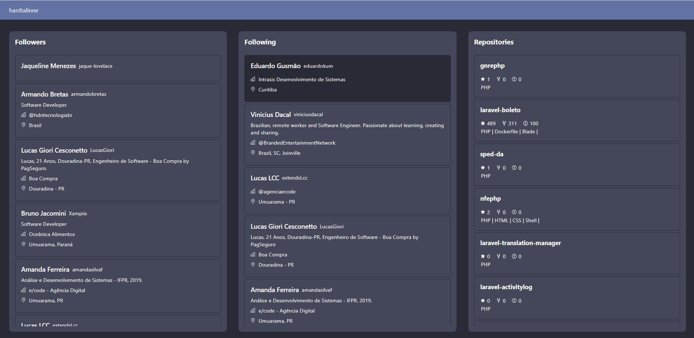
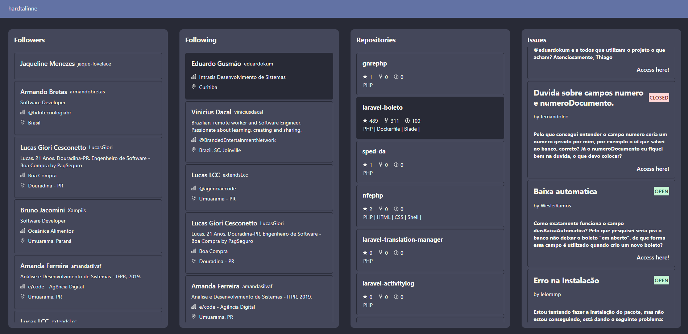

# 
<h1 align="center">Atividade Final - React</h1>

# Sobre o Projeto 

Projeto desenvolvido na disciplina de React, Pós Graduação - WEB DEV UniAlfa

Tem como finalidade o consumo da api do GitHub.

## Como executar?

Após clonar o projeto é necessario realizar configurações utilize o .env.example e renomeie para .env as variáveis CLIENT_ID e CLIENT_SECRET, quais são utilizadas para autenticação são conseguidas nas configurações pessoais do seu Github para mais informações acesse [Fundamentos da autenticação](https://docs.github.com/pt/rest/guides/basics-of-authentication) 
## Comando para executar
```
❯ npm run start
```
```
❯ npm run start:api
```

## Demonstração do Projeto

<h1 align="center">
  
</h1>

<h1 align="center">
  
</h1>